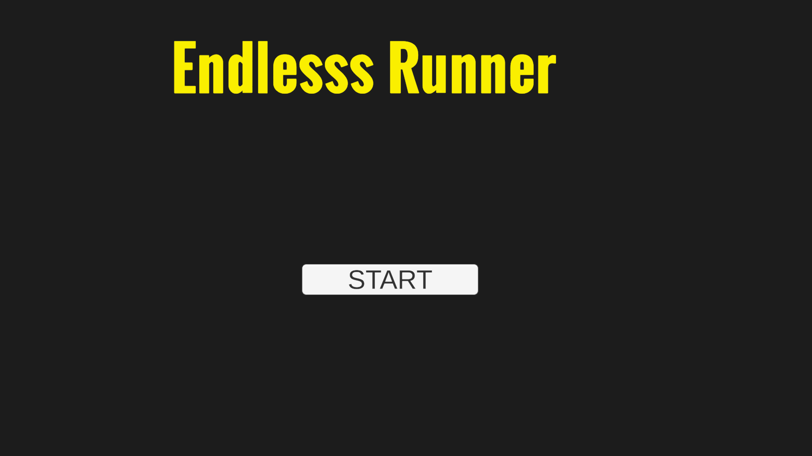
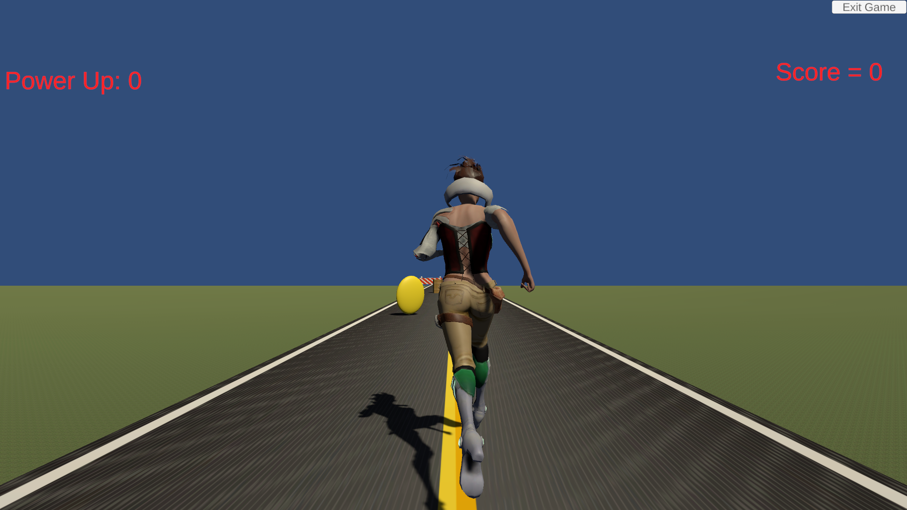
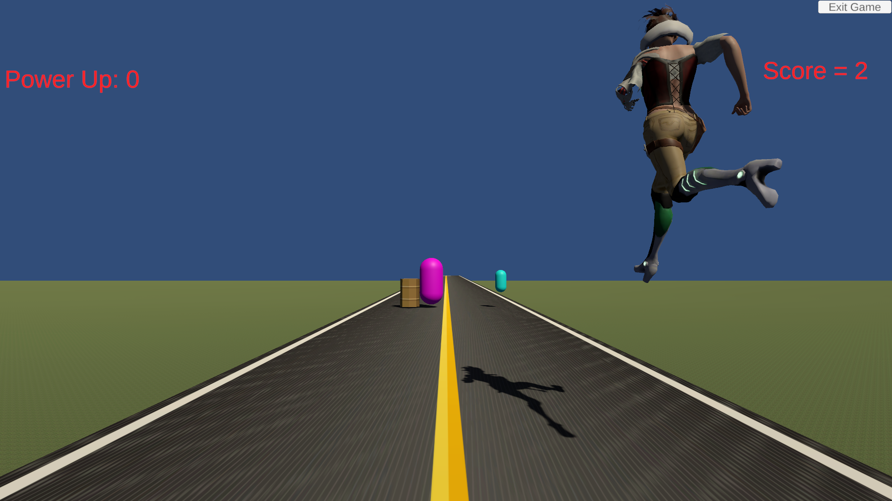
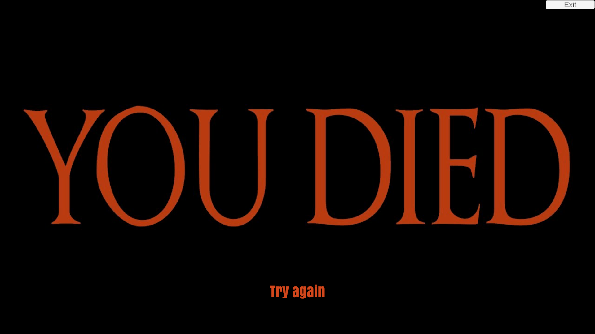

# Endless Runner

A 3D endless runner game developed in Unity using C#.

## About

In Endless Runner, the player must dodge obstacles, collect coins, and survive for as long as possible while achieving the highest score.

## Features

- Endless gameplay
- Coin collection system
- Score tracking
- Power-ups
- Random obstacle spawning
- Character animations
- Sound effects

## Controls

| Key | Action |
|------|---------|
| A | Move Left |
| D | Move Right |
| Space | Jump |

## Built With

- Unity
- C#
- Visual Studio

## Screenshots

### Start Menu

### Gameplay

### Game Over Screen

## What I Learned

- Unity game development fundamentals
- C# scripting
- Prefab management
- Collision detection
- UI systems
- Audio integration
- Game state management

## Author

**Febin Biju**
